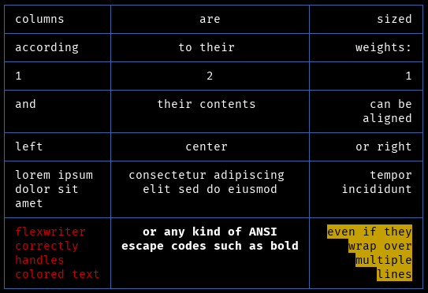

# Flexwriter

[](https://pkg.go.dev/github.com/hchargois/flexwriter)

```
go get github.com/hchargois/flexwriter
```

Flexwriter arranges rows of data into columns with configurable widths and alignments.

As the name suggests, it is inspired by (but not identical to) the CSS flexbox model to define column widths.
To be more precise, it is actually inspired by Gio UI's variation of the flexbox model: 
https://pkg.go.dev/gioui.org/layout#Flex

If the contents are too long, flexwriter automatically wraps the text in multiple lines.
Text containing escape sequences (e.g. color codes) is correctly wrapped.

The output can be decorated with simple column separators or to look like tables.



# Basic usage

```go
import "github.com/hchargois/flexwriter"

// by default, the flexwriter will output to standard output; and all
// columns will default to being left-aligned rigids with no maximum width,
// (i.e. they will be exactly as wide as needed to fit their content);
// and all columns will be separated by two spaces
writer := flexwriter.New()

// write some data (any non-string will pass through fmt.Sprint)
writer.WriteRow("deep", "thought", "says", ":")
writer.WriteRow("the", "answer", "is", 42)
writer.WriteRow(true, "or", false, "?")

// calling Flush() is required to actually output the rows
writer.Flush()
```

This will output:

```
deep  thought  says   :
the   answer   is     42
true  or       false  ?
```

More complete examples showing how to configure the columns can be found in the godoc.

# Alternatives

 - the OG, standard library's [text/tabwriter](https://pkg.go.dev/text/tabwriter)
 - for a more full-fledged table writer, see [github.com/olekukonko/tablewriter](https://github.com/olekukonko/tablewriter)
   but note that as of Jan 2025 it doesn't correctly handle wrapping text
   with escape strings.

# Thanks

 - [Gio UI](https://gioui.org) for the [flex model](https://pkg.go.dev/gioui.org/layout#Flex) inspiration
 - [github.com/MichaelMure/go-term-text](https://github.com/MichaelMure/go-term-text) for the escape-sequence aware text wrapping
